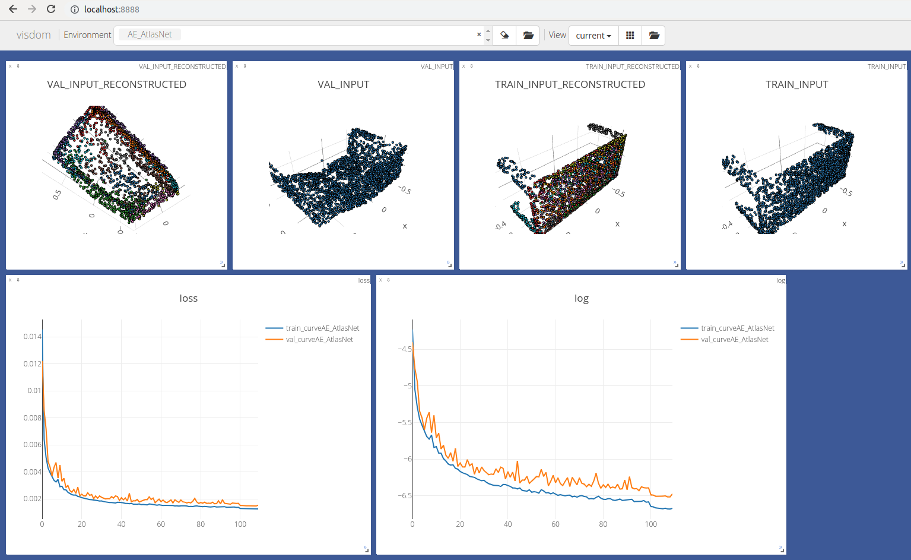

🚀 Follow-up project 🚀 : [Learning Elementary Structures](https://github.com/TheoDEPRELLE/AtlasNetV2)

<details><summary>🚀 Major refacto 11-2019 🚀 </summary>
- [x] Factorize SVR and autoencoder <br>
- [x] Factorise Square template and Sphere <br>
- [x] Add latent vector as bias (30% speedup) <br>
- [x] Remove last th in decoder <br>
- [x] Make large .pth tensor with all pointclouds in cache(drop the nasty Chunk_reader) <br>
- [x] Make-it multi-gpu <br>
- [x] Add netvision results <br>
- [x] Rewrite main script object-oriented  <br>
- [x] Check that everything works in latest pytorch version <br>
- [x] Add more layer by default and flag for the number of layers <br>
- [x] Add a flag to generate a mesh directly <br>
- [x] Add a python setup install ( that update the submodule, and install the right packages) <br>
- [x] Make sure GPU are used at 100% <br>
- [x] Add f-score in Chamfer + report f-score <br>
- [x] Get rid of shapenet_v2 data and use v1! <br>
- [x] Fix path no more sys.path.append <br>
- [x] Preprocess shapenet 55 and add it in dataloader <br>
- [x] Make minimal dependencies <br>
</details>


# AtlasNet [[Project Page]](http://imagine.enpc.fr/~groueixt/atlasnet/) [[Paper]](https://arxiv.org/abs/1802.05384) [[Talk]](http://imagine.enpc.fr/~groueixt/atlasnet/atlasnet_slides_spotlight_CVPR.pptx)

**AtlasNet: A Papier-Mâché Approach to Learning 3D Surface Generation** <br>
Thibault Groueix,  Matthew Fisher, Vladimir G. Kim , Bryan C. Russell, Mathieu Aubry  <br>
In [CVPR, 2018](http://cvpr2018.thecvf.com/).


    


The network is able to synthesize a mesh (point cloud + connectivity) from a low-resolution point cloud, or from an image.


# Install

This implementation uses [Pytorch](http://pytorch.org/), [Pymesh](https://github.com/PyMesh/PyMesh). 

```shell
git clone https://github.com/ThibaultGROUEIX/AtlasNet.git
cd AtlasNet
git submodule update --init
python setup.py install
```


# Demo   ```python inference/demo.py```


    


# Training  ```python ./training/train.py```


:raised_hand_with_fingers_splayed: Monitor your training on http://localhost:8888/




# Evaluate  ```python ./training/test.py```


<details><summary>Quantitative Results </summary>


The number reported are the chamfer distance, the f-score and the [metro](https://github.com/ThibaultGROUEIX/AtlasNet/issues/34) distance.

| Method | Chamfer⁽⁰⁾ | Fscore |Metro|GPU memory|Total Train time|
| ---------- | --------------------- | --------------------- | --------------------- | --------------------- | --------------------- |
| Autoencoder 25 Squares | - | -   |-|-|-|
| Autoencoder 1 Sphere              | - |-|-|-|-|
| SingleView 25  Squares   | - |-|-|-|-|
| SingleView 1 Sphere |- |-|-|-|-|

⁽⁰⁾  computed between 2500 ground truth points and 2500 reconstructed points.

⁽¹⁾ with the flag ```--accelerated_chamfer 1```.

⁽²⁾this is only an estimate, the code is not optimised.  The easiest way to enhance it would be to preload the training data to use the GPU at 100%. Time computed with the flag ```--accelerated_chamfer 1```.
Visualisation 

The generated 3D models' surfaces are not oriented. As a consequence, some area will appear dark if you directly visualize the results in [Meshlab](http://www.meshlab.net/). You have to incorporate your own fragment shader in Meshlab, that flip the normals in they are hit by a ray from the wrong side. An exemple is given for the [Phong BRDF](https://en.wikipedia.org/wiki/Phong_reflection_model).

```shell
sudo mv /usr/share/meshlab/shaders/phong.frag /usr/share/meshlab/shaders/phong.frag.bak
sudo cp auxiliary/phong.frag /usr/share/meshlab/shaders/phong.frag #restart Meshlab
```

</details>

### 


## Cool Contributions

* **[Yana Hasson](https://github.com/hassony2)** trained our sphere model, for Single View Reconstruction (SVR) in view-centered coordinates : performances are unaffected! Qualitative and quantitative results follow. Many thanks !
View [this paper](http://openaccess.thecvf.com/content_cvpr_2018/CameraReady/3826.pdf) for a good review of on object-centered representation VS view-centered representation.

<details><summary>Quantitative Results </summary>


| frame | Average recontruction error for SVR (x1000) : chamfer distance on input pointcloud and reconstruction of size 2500 pts|
| ---------- | -------------------- |
| object-centered | 4.87⁽⁴⁾ |
| view-centered    | 4.88   |


⁽⁴⁾ Trained with Atlasnet v2 (with learning rate scheduler : slightly better than the paper's result)

</details>


## Paper reproduction 

In case you need the results of ICP on PointSetGen output :

* [ICP on PSG](https://cloud.enpc.fr/s/3a7Xg9RzIsgmofw)


## Citing this work

If you find this work useful in your research, please consider citing:

```
@inproceedings{groueix2018,
          title={{AtlasNet: A Papier-M\^ach\'e Approach to Learning 3D Surface Generation}},
          author={Groueix, Thibault and Fisher, Matthew and Kim, Vladimir G. and Russell, Bryan and Aubry, Mathieu},
          booktitle={Proceedings IEEE Conf. on Computer Vision and Pattern Recognition (CVPR)},
          year={2018}
        }
```

### 

## Acknowledgement

The code for the Chamfer Loss was adapted from Fei Xia' repo : [PointGan](https://github.com/fxia22/pointGAN). Many thanks to him !

This work was funded by [Adobe System](https://github.com/fxia22/pointGAN) and [Ecole Doctorale MSTIC](http://www.univ-paris-est.fr/fr/-ecole-doctorale-mathematiques-et-stic-mstic-ed-532/).


## 🚀 Related project 🚀:

*  [Learning Elementary Structures](https://github.com/TheoDEPRELLE/AtlasNetV2)
*  [3D-CODED](https://github.com/ThibaultGROUEIX/3D-CODED)
*  [Cycle Consistent Deformations](https://github.com/ThibaultGROUEIX/CycleConsistentDeformation)

## License

When using the provided data make sure to respect the shapenet [license](https://shapenet.org/terms).

<<<<<<< HEAD
[MIT](https://github.com/ThibaultGROUEIX/AtlasNet/blob/master/license_MIT)
=======
[MIT](https://github.com/ThibaultGROUEIX/AtlasNet/blob/master/license_MIT)


```
>>>>>>> 91ce35c021084aafe057200945358aec4ba3cd30
