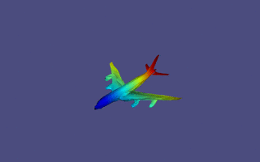

# AtlasNet [[Project Page]](http://imagine.enpc.fr/~groueixt/atlasnet/) [[Paper]](https://arxiv.org/abs/1802.05384) [[Talk]](http://imagine.enpc.fr/~groueixt/atlasnet/atlasnet_slides_spotlight_CVPR.pptx)

**AtlasNet: A Papier-Mâché Approach to Learning 3D Surface Generation** <br>
Thibault Groueix,  Matthew Fisher, Vladimir G. Kim , Bryan C. Russell, Mathieu Aubry  <br>
In [CVPR, 2018](http://cvpr2018.thecvf.com/).


    




<details><summary>🚀 Major refacto 11-2019 🚀 </summary>
- [x] Factorize SVR and autoencoder <br>
- [x] Factorise Square template and Sphere <br>
- [x] Add latent vector as bias (30% speedup) <br>
- [x] Remove last th in decoder <br>
- [x] Make large .pth tensor with all pointclouds in cache(drop the nasty Chunk_reader) <br>
- [x] Make-it multi-gpu <br>
- [x] Add netvision results <br>
- [x] Rewrite main script object-oriented  <br>
- [x] Check that everything works in latest pytorch version <br>
- [x] Add more layer by default and flag for the number of layers <br>
- [x] Add a flag to generate a mesh directly <br>
- [x] Add a python setup install ( that update the submodule, and install the right packages) <br>
- [x] Make sure GPU are used at 100% <br>
- [x] Add f-score in Chamfer + report f-score <br>
- [x] Get rid of shapenet_v2 data and use v1! <br>
- [x] Fix path no more sys.path.append <br>
- [x] Preprocess shapenet 55 and add it in dataloader <br>
- [x] Make minimal dependencies <br>
</details>


The network is able to synthesize a mesh (point cloud + connectivity) from a low-resolution point cloud, or from an image.


# Install

This implementation uses [Pytorch](http://pytorch.org/), [Pymesh](https://github.com/PyMesh/PyMesh). 

```shell
git clone https://github.com/ThibaultGROUEIX/AtlasNet.git
cd AtlasNet
git submodule update --init
python setup.py install
```


# Usage

* **[Demo](./doc/demo.md)** :    ```python inference/demo.py```

* **[Training](./doc/training.md)** :  ```python ./training/train.py```

* **[Trained models evaluation](./doc/training.md)**:  ```python ./training/launch.py --mode test```

  

## Citing this work

```
@inproceedings{groueix2018,
          title={{AtlasNet: A Papier-M\^ach\'e Approach to Learning 3D Surface Generation}},
          author={Groueix, Thibault and Fisher, Matthew and Kim, Vladimir G. and Russell, Bryan and Aubry, Mathieu},
          booktitle={Proceedings IEEE Conf. on Computer Vision and Pattern Recognition (CVPR)},
          year={2018}
        }
```

### 

## 🚀 Related project 🚀:

*  [Learning Elementary Structures](https://github.com/TheoDEPRELLE/AtlasNetV2)
*  [3D-CODED](https://github.com/ThibaultGROUEIX/3D-CODED)
*  [Cycle Consistent Deformations](https://github.com/ThibaultGROUEIX/CycleConsistentDeformation)

[Cool Contributions from Yana Hasson](./doc/contributions.md)

[Meshlab Visualization Trick](./doc/meshlab.md)

The code for the Chamfer Loss was adapted from Fei Xia' repo : [PointGan](https://github.com/fxia22/pointGAN). Many thanks to him !

This work was funded by [Adobe System](https://github.com/fxia22/pointGAN) and [Ecole Doctorale MSTIC](http://www.univ-paris-est.fr/fr/-ecole-doctorale-mathematiques-et-stic-mstic-ed-532/).

When using the provided data make sure to respect the shapenet [license](https://shapenet.org/terms).

